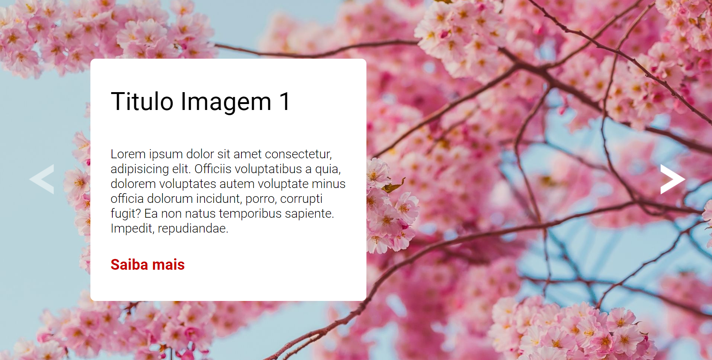

# Slider

## Visualizaçao do projeto

## Linguagens utilizadas
- HTML
- CSS
- JavaScript

## Comentario

Projeto simples proposto pelo curso DevQuest,onde a responsividade não foi feita, por ter como único objeto iniciar na prática em JavaScript. 
